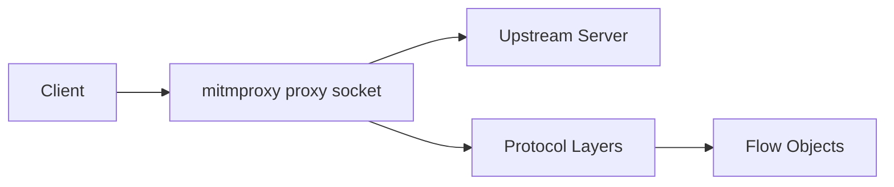
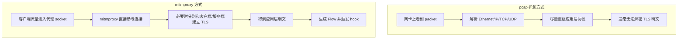
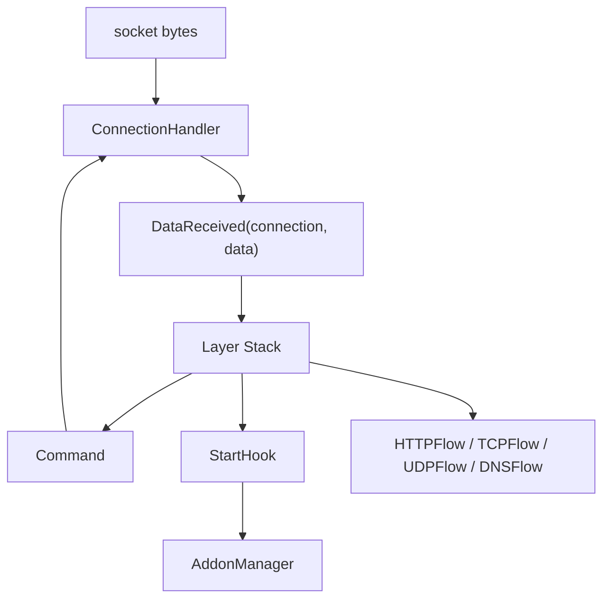
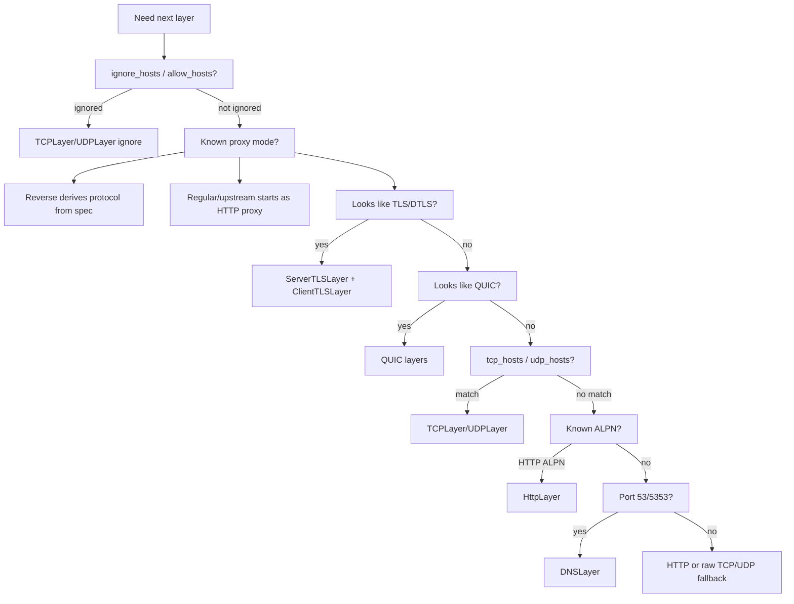
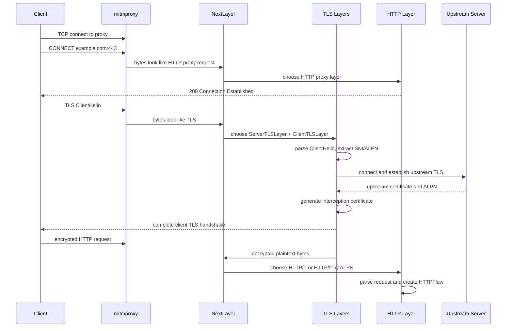
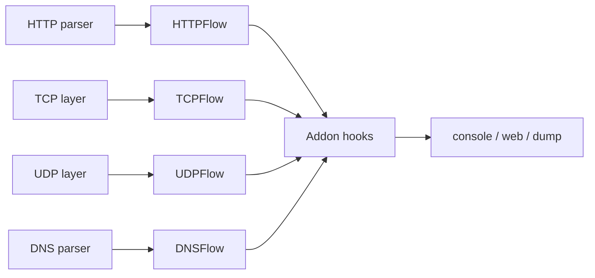
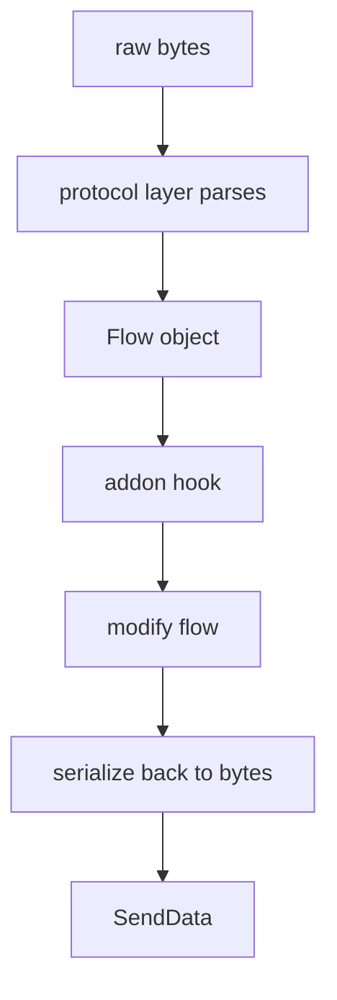

# Traffic Capture and Protocol Parsing

本文档说明 mitmproxy 的“抓包”方式，以及它如何把网络流量解析成 HTTP、TLS、DNS、TCP、UDP、WebSocket 等协议对象。

## 1. 它不是 pcap 抓包器

mitmproxy 的抓包方式不是 `pcap`。

它不像 Wireshark、tcpdump 那样通过 `libpcap` 在网卡层旁路捕获 IP/TCP/UDP packet。mitmproxy 的核心工作方式是“代理式拦截”：让目标流量实际经过 mitmproxy 的 socket，然后 mitmproxy 在连接中间解析和修改应用层协议。

也就是说：

- Wireshark/tcpdump 更接近“旁观网络包”。
- mitmproxy 更接近“成为客户端和服务端之间的代理节点”。



## 2. 不同模式下流量如何进入 mitmproxy

mitmproxy 支持多种代理模式，不同模式让流量进入 mitmproxy 的方式不同。

### 2.1 Regular 模式

regular 是常规显式 HTTP(S) 代理模式。客户端需要主动配置代理地址，例如 `127.0.0.1:8080`。

HTTP 请求会直接发给 mitmproxy：

```http
GET http://example.com/index.html HTTP/1.1
```

HTTPS 请求会先发起 `CONNECT`：

```http
CONNECT example.com:443 HTTP/1.1
```

然后客户端在这个代理连接里开始 TLS 握手。

### 2.2 Transparent 模式

transparent 是透明代理模式。客户端通常不知道 mitmproxy 的存在，系统防火墙或路由规则把原本发往目标服务器的连接重定向到 mitmproxy。

这种模式下，mitmproxy 需要通过平台相关机制查询原始目标地址：

- Linux: 通常依赖 iptables/nftables 相关能力。
- macOS/OpenBSD: 通常依赖 pf。
- Windows: 有专门平台实现。

相关代码在 `mitmproxy/platform/`。

### 2.3 Reverse 模式

reverse 模式下，mitmproxy 表现得像一个普通服务端，但它会把收到的请求转发到固定上游目标。

例如：

```text
--mode reverse:https://example.com
```

此时客户端访问 mitmproxy，mitmproxy 总是转发到 `example.com`。

### 2.4 WireGuard、local、tun 模式

这些模式更接近系统级或网络级接入，但仍然不是 pcap 旁路抓包。

它们让流量进入 mitmproxy 的方式分别依赖：

- WireGuard 隧道。
- 本地进程重定向。
- TUN 虚拟网络设备。

底层能力主要由 `mitmproxy_rs` 提供。

## 3. pcap 和代理式拦截的区别



pcap 工具看到的是 packet，需要自己重组连接和应用层协议。TLS 流量如果没有密钥，通常只能看到密文。

mitmproxy 看到的是经过它的连接流。对于 TLS，mitmproxy 会使用本地 CA 动态签发证书，分别和客户端、服务端建立 TLS，因此可以在中间拿到明文应用层数据。

## 4. 从 socket 到协议对象的主链路

mitmproxy 的协议解析不是一次性完成的，而是分层逐步完成。

主链路如下：



关键代码：

- `mitmproxy/proxy/server.py`: 真实 socket I/O。
- `mitmproxy/proxy/events.py`: 事件类型。
- `mitmproxy/proxy/commands.py`: 命令类型。
- `mitmproxy/proxy/layer.py`: 协议 layer 基类。
- `mitmproxy/addons/next_layer.py`: 动态协议识别。

## 5. Event 和 Command 模型

mitmproxy 把真实 I/O 和协议解析分开。

I/O 层从 socket 读到 bytes 后，会创建事件：

```text
DataReceived(connection, data)
```

协议 layer 消费事件，并产生命令：

```text
SendData(connection, data)
OpenConnection(server)
CloseConnection(connection)
StartHook(...)
```

这种模型的好处是协议解析层不直接操作 socket。协议 layer 可以专注处理状态机，I/O 层统一负责读写、连接、关闭和 backpressure。

## 6. Layer 栈如何工作

`Layer` 是 mitmproxy 协议解析的核心抽象。每个 layer 负责一个协议或一个代理阶段，例如：

- `HttpProxy`
- `ReverseProxy`
- `TransparentProxy`
- `Socks5Proxy`
- `ServerTLSLayer`
- `ClientTLSLayer`
- `HttpLayer`
- `DNSLayer`
- `TCPLayer`
- `UDPLayer`
- QUIC/HTTP3 layer

Layer 的输入是事件，输出是命令。它使用 Python generator 模拟“暂停/恢复”的协议流程。

例如协议层可以写出类似同步代码的逻辑：

```python
err = yield commands.OpenConnection(self.context.server)
```

如果命令是 blocking，当前 layer 会暂停。等连接完成后，I/O 层会发回 `OpenConnectionCompleted`，layer 再继续执行。

这让复杂协议状态机更容易表达，例如：

- 等待上游 TCP 连接建立。
- 等待 TLS 握手完成。
- 等待 addon 对 request/response 做完处理。
- HTTP/2 多路复用场景中暂停某个 stream，而不是暂停整个连接。

## 7. NextLayer 如何判断协议

当 mitmproxy 还不知道当前连接应该交给哪个协议解析器时，会使用 `NextLayer`。

`NextLayer` 会暂存已经收到的事件和 bytes，然后触发 `next_layer` hook。默认实现位于：

```text
mitmproxy/addons/next_layer.py
```

判断依据包括：

- 当前代理模式。
- 目标地址和端口。
- 客户端首包 bytes。
- 是否像 TLS/DTLS record。
- 是否像 QUIC packet。
- TLS/QUIC 握手后的 ALPN。
- `ignore_hosts` / `allow_hosts`。
- `tcp_hosts` / `udp_hosts`。
- `rawtcp` 配置。

简化判断流程：



## 8. HTTPS 的完整解析过程

HTTPS 是理解 mitmproxy 协议解析最典型的例子。

以 regular 代理模式为例：



这个过程中，mitmproxy 至少进行了三次“协议层选择”：

1. 连接刚进来时，识别为 HTTP proxy 请求。
2. `CONNECT` 之后，识别为 TLS。
3. TLS 解密后，根据 ALPN 或明文内容识别为 HTTP/1、HTTP/2 等应用协议。

## 9. HTTP、HTTP/2、HTTP/3 等协议靠什么解析

mitmproxy 自己维护协议 layer，但会依赖成熟协议库处理底层协议细节。

主要依赖包括：

- HTTP/1: `h11`
- HTTP/2: `h2`
- HTTP/3/QUIC: `aioquic`
- WebSocket: `wsproto`
- TLS: `pyOpenSSL` / `cryptography`
- UDP、WireGuard、local redirector、TUN 等底层能力: `mitmproxy_rs`

这些依赖可以在 `pyproject.toml` 中看到。

对应代码大致分布：

- `mitmproxy/proxy/layers/http/`: HTTP/1、HTTP/2、HTTP/3 相关 layer。
- `mitmproxy/proxy/layers/tls.py`: TLS/DTLS layer。
- `mitmproxy/proxy/layers/websocket.py`: WebSocket layer。
- `mitmproxy/proxy/layers/dns.py`: DNS layer。
- `mitmproxy/proxy/layers/tcp.py`: raw TCP layer。
- `mitmproxy/proxy/layers/udp.py`: raw UDP layer。
- `mitmproxy/proxy/layers/quic/`: QUIC 相关 layer。

## 10. 解析后的统一结果：Flow

协议 layer 解析完成后，会构造或更新 Flow。

常见 Flow 类型：

- `HTTPFlow`: 一次 HTTP 请求/响应，可能包含 WebSocket 数据。
- `TCPFlow`: TCP 消息序列。
- `UDPFlow`: UDP 消息序列。
- `DNSFlow`: DNS 请求/响应。

Flow 是 UI、脚本、保存、重放、过滤等功能的统一操作对象。



关键文件：

- `mitmproxy/flow.py`
- `mitmproxy/http.py`
- `mitmproxy/tcp.py`
- `mitmproxy/udp.py`
- `mitmproxy/dns.py`
- `mitmproxy/eventsequence.py`

## 11. 为什么 mitmproxy 能修改流量

因为 mitmproxy 不是旁路观察者，而是连接路径上的代理节点。

当协议 layer 解析出请求或响应后，会触发生命周期 hook，例如：

- `requestheaders`
- `request`
- `responseheaders`
- `response`
- `websocket_message`
- `tcp_message`
- `udp_message`
- `dns_request`
- `dns_response`

addon 可以在这些 hook 中修改 Flow。修改后的 Flow 再由协议 layer 序列化回 bytes，通过 `SendData` 命令写回客户端或上游服务器。

简化流程：



这也是 mitmproxy 和 pcap 工具的根本差异：pcap 工具通常只观察和分析，mitmproxy 可以自然地修改和重放，因为它实际参与连接。

## 12. 代码阅读入口

建议按下面顺序阅读：

1. `mitmproxy/proxy/server.py`: 看 socket bytes 如何进入 `ConnectionHandler`。
2. `mitmproxy/proxy/events.py`: 看 I/O 事件模型。
3. `mitmproxy/proxy/commands.py`: 看 layer 如何要求外部执行动作。
4. `mitmproxy/proxy/layer.py`: 看 layer 暂停/恢复机制。
5. `mitmproxy/addons/next_layer.py`: 看协议如何自动识别。
6. `mitmproxy/proxy/layers/modes.py`: 看不同代理模式的顶层 layer。
7. `mitmproxy/proxy/layers/tls.py`: 看 TLS 如何被拆成客户端侧和服务端侧。
8. `mitmproxy/addons/tlsconfig.py`: 看 TLS 上下文和证书如何配置。
9. `mitmproxy/proxy/layers/http/`: 看 HTTP/1、HTTP/2、HTTP/3 layer。
10. `mitmproxy/flow.py` 和 `mitmproxy/http.py`: 看最终暴露给用户和 addon 的数据模型。

## 13. 简短总结

mitmproxy 的“抓包”不是基于 pcap 的网卡旁路抓包，而是代理式拦截。

它让流量经过自己的 socket，把网络输入包装成事件，交给动态协议 layer 栈解析。协议 layer 根据代理模式、首包特征、TLS ClientHello、ALPN、端口和配置决定下一层协议。解析出的请求、响应或消息会变成统一的 Flow 对象，再通过 addon hook 暴露给 UI、脚本、保存、重放和修改功能。
