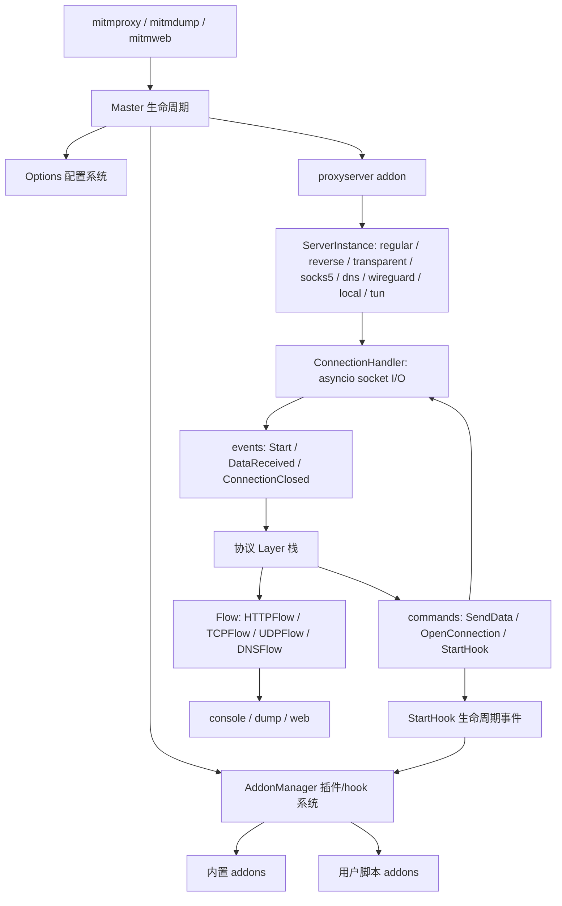
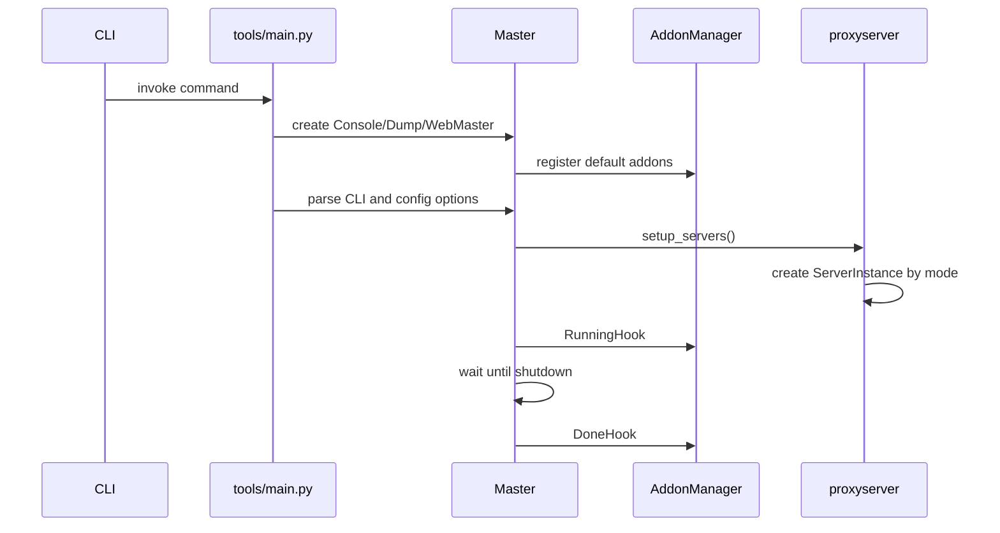
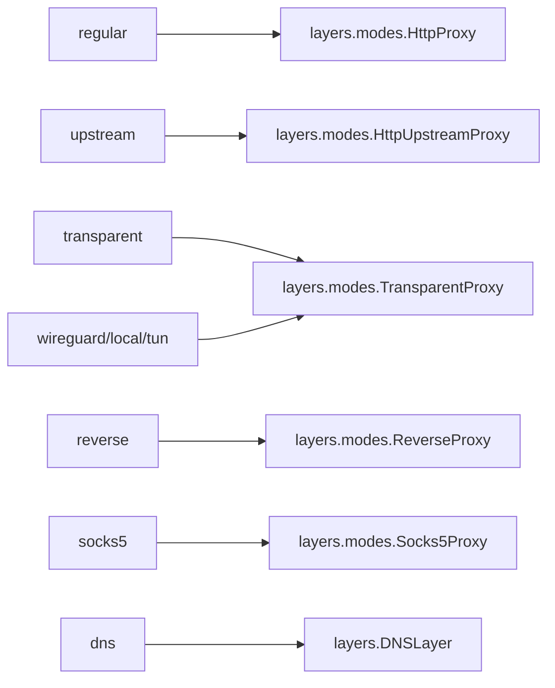
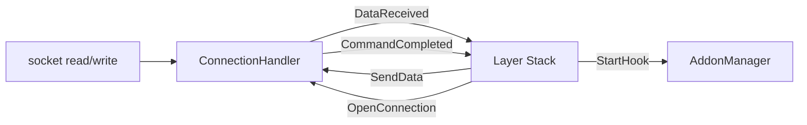
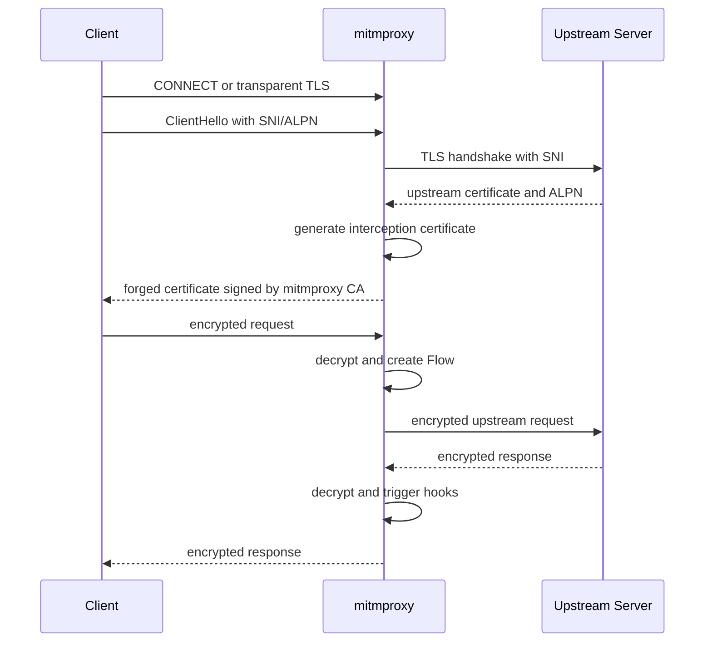
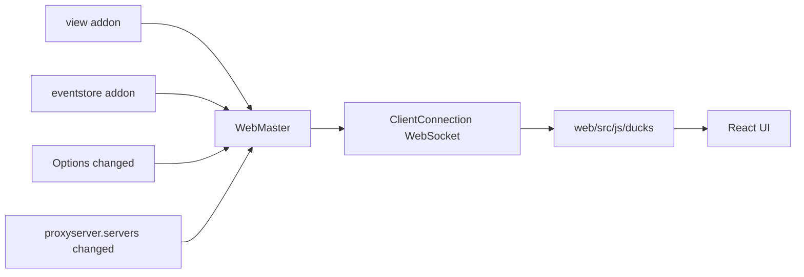

# mitmproxy Architecture Overview

本文档是对本仓库的代码导览，目标是说明 mitmproxy 的功能、运行原理、核心模块和重要设计。它不是用户手册，而是面向代码阅读和二次开发的架构说明。

## 1. 项目定位

mitmproxy 是一个可交互、可编程的中间人代理工具。它可以拦截、查看、修改、保存、重放多种网络流量，包括：

- HTTP/1
- HTTP/2
- HTTP/3
- WebSocket
- TCP
- UDP
- DNS
- TLS/DTLS/QUIC 上承载的协议

项目提供三个主要命令入口：

- `mitmproxy`: 终端 TUI 交互界面。
- `mitmdump`: 命令行/脚本化版本，类似面向 HTTP 的 tcpdump。
- `mitmweb`: Web UI。

三个命令共享同一个代理核心，差别主要在展示方式、交互方式和额外加载的 UI addon。

入口定义：

- `pyproject.toml`: console scripts。
- `mitmproxy/tools/main.py`: 三个命令共同的启动逻辑。
- `mitmproxy/tools/dump.py`: `mitmdump` 对应的 `DumpMaster`。
- `mitmproxy/tools/console/master.py`: `mitmproxy` 对应的 `ConsoleMaster`。
- `mitmproxy/tools/web/master.py`: `mitmweb` 对应的 `WebMaster`。

## 2. 总体架构

mitmproxy 的核心可以理解为四层：

1. 进程和生命周期层：负责解析命令行、加载配置、启动主循环。
2. 代理服务器层：负责真实 socket I/O，监听不同代理模式的端口。
3. 协议层栈：把网络字节解析为协议事件，并产生 I/O 命令。
4. addon/hook 层：把可观察和可修改的生命周期事件暴露给内置功能、UI 和用户脚本。



## 3. 启动流程

命令入口位于 `mitmproxy/tools/main.py`。三个命令最终都调用同一个 `run()` 函数，只是传入不同的 `Master` 子类：

- `mitmproxy` 使用 `ConsoleMaster`。
- `mitmdump` 使用 `DumpMaster`。
- `mitmweb` 使用 `WebMaster`。

启动流程大致如下：



关键文件：

- `mitmproxy/tools/main.py`
- `mitmproxy/master.py`
- `mitmproxy/addons/__init__.py`
- `mitmproxy/addons/proxyserver.py`

## 4. Master 和生命周期

`Master` 是整个程序的生命周期总控，定义在 `mitmproxy/master.py`。

它负责：

- 持有全局 `Options`。
- 创建 `CommandManager`。
- 创建 `AddonManager`。
- 设置 `mitmproxy.ctx` 中的全局上下文。
- 启动 proxy server。
- 触发 `RunningHook` 和 `DoneHook`。
- 处理 shutdown。

不同 UI 入口通过继承 `Master` 加载不同 addon：

- `DumpMaster`: 加载 dumper、readfile、keepserving 等命令行功能。
- `ConsoleMaster`: 加载 view、eventstore、intercept、console UI 相关 addon。
- `WebMaster`: 加载 Tornado app、WebSocket 广播、Web UI 相关 addon。

设计重点：核心代理能力不属于 UI 层，UI 只是订阅和操作 flow。

## 5. Options 配置系统

配置定义主要在 `mitmproxy/options.py`，底层管理器在 `mitmproxy/optmanager.py`。

`Options` 不是普通对象，而是一个带类型检查、默认值、回滚、变更通知的配置管理器。

重要特性：

- 每个 option 有类型、默认值、帮助文本和可选 choices。
- addon 可以在 `load(loader)` 中动态注册自己的 option。
- 配置变更会触发 `ConfigureHook`。
- 如果配置处理过程中抛出 `OptionsError`，变更会回滚。

这使得核心、插件和 UI 都能围绕同一套配置系统工作。

## 6. Addon 和 Hook 系统

addon 是 mitmproxy 的扩展机制。内置功能和用户脚本本质上都以 addon 的方式接入。

核心文件：

- `mitmproxy/addonmanager.py`
- `mitmproxy/hooks.py`
- `mitmproxy/addons/__init__.py`

`AddonManager` 负责：

- 注册 addon。
- 调用 addon 的 `load()`。
- 收集 addon 暴露的 command。
- 根据 hook 名称调用 addon 方法。
- 支持同步和异步 hook。
- 在 flow 生命周期事件后触发 `UpdateHook`。

例如一个 addon 如果实现：

```python
def request(flow):
    flow.request.headers["x-added-by-addon"] = "1"
```

那么 HTTP 请求事件到达时，`AddonManager` 会自动调用这个方法。

默认内置 addon 包括：

- `proxyserver`: 启动和管理代理服务器。
- `next_layer`: 动态判断协议层。
- `tlsconfig`: TLS/证书配置。
- `maplocal` / `mapremote`: 本地映射和远程映射。
- `modifybody` / `modifyheaders`: 修改消息体和头。
- `clientplayback` / `serverplayback`: 请求/响应重放。
- `save` / `savehar`: 保存 flow。
- `script`: 加载用户脚本。

## 7. 代理服务器和代理模式

代理服务器相关逻辑分两部分：

- `mitmproxy/proxy/mode_specs.py`: 解析代理模式。
- `mitmproxy/proxy/mode_servers.py`: 根据代理模式启动对应服务实例。

支持的模式包括：

- `regular`: 常规 HTTP(S) 代理。
- `transparent`: 透明代理。
- `upstream:SPEC`: 上游代理模式。
- `reverse:SPEC`: 反向代理。
- `socks5`: SOCKS5 代理。
- `dns`: DNS 代理。
- `wireguard`: WireGuard 接入。
- `local`: 本地进程透明代理。
- `tun`: TUN 设备模式。

`ServerInstance` 使用子类注册机制：每个 mode 类型对应一个 server instance 类型。启动时 `proxyserver` 根据 `options.mode` 创建对应实例。

不同模式会创建不同的顶层 layer：



关键文件：

- `mitmproxy/addons/proxyserver.py`
- `mitmproxy/proxy/mode_specs.py`
- `mitmproxy/proxy/mode_servers.py`
- `mitmproxy/proxy/layers/modes.py`

## 8. I/O 和协议层的分离

mitmproxy 的代理核心采用 events/commands 的 sans-IO 风格。

真实 socket I/O 在 `mitmproxy/proxy/server.py` 中处理。协议层不直接读写 socket，而是：

- 接收 `Event`
- 输出 `Command`

常见 `Event`：

- `Start`
- `DataReceived`
- `ConnectionClosed`
- `CommandCompleted`
- `HookCompleted`

常见 `Command`：

- `OpenConnection`
- `SendData`
- `CloseConnection`
- `RequestWakeup`
- `StartHook`
- `Log`



这个设计把协议状态机和实际网络 I/O 解耦，带来几个好处：

- 协议层更容易测试。
- I/O 调度集中在 `ConnectionHandler`。
- layer 可以像同步代码一样表达复杂协议流程。
- HTTP/2 多路复用、TLS 握手、上游连接建立等复杂流程可以通过 blocking command 暂停和恢复。

## 9. Layer 栈和动态协议识别

协议层基类在 `mitmproxy/proxy/layer.py`。

`Layer.handle_event()` 接收事件并返回命令。layer 内部使用 generator 实现“伪阻塞”：

```python
err = yield OpenConnection(server)
```

如果 command 是 blocking，当前 layer 会暂停，等 `CommandCompleted` 回来后继续执行。暂停期间收到的其他事件会排队，恢复后再处理。

`NextLayer` 是一个特殊 layer，用于在协议未知时暂存事件，并触发 `next_layer` hook。默认的判断逻辑由 `mitmproxy/addons/next_layer.py` 提供。

协议识别大致逻辑：

1. 先检查 `ignore_hosts` / `allow_hosts`。
2. 根据代理模式处理已知起始协议。
3. 判断是否是 TLS/DTLS。
4. 判断是否是 QUIC。
5. 检查 `tcp_hosts` / `udp_hosts`。
6. 根据 ALPN 判断 HTTP。
7. 根据端口判断 DNS。
8. UDP 默认走 raw UDP。
9. 如果像非 HTTP 且允许 raw TCP，则走 raw TCP。
10. 否则默认按 HTTP 处理。

典型 HTTPS 请求会多次经过 `NextLayer`：

1. 第一次判断客户端是显式 HTTP proxy 请求。
2. CONNECT 后判断客户端开始 TLS。
3. TLS 解密后再判断内部协议，例如 HTTP/1、HTTP/2 或 WebSocket。

## 10. TLS MITM 原理

TLS 相关核心：

- `mitmproxy/proxy/layers/tls.py`
- `mitmproxy/addons/tlsconfig.py`
- `mitmproxy/certs.py`

mitmproxy 的 TLS MITM 过程可以概括为：

1. 客户端连接 mitmproxy。
2. 客户端发送 `CONNECT` 或透明代理下直接开始 TLS。
3. mitmproxy 读取客户端 `ClientHello`，提取 SNI 和 ALPN。
4. 如需上游证书信息，mitmproxy 先连接真实服务器并完成服务端 TLS 握手。
5. mitmproxy 根据上游证书、SNI、本地 CA 动态生成面向客户端的证书。
6. mitmproxy 与客户端完成 TLS 握手。
7. 客户端和服务端两边都是 TLS，但 mitmproxy 在中间拿到明文并继续交给内部协议 layer。



`tlsconfig` 同时负责客户端侧和服务端侧 TLS 上下文：

- 客户端侧：mitmproxy 扮演服务器，使用动态证书。
- 服务端侧：mitmproxy 扮演客户端，设置 SNI、ALPN、证书验证和客户端证书。

证书存储由 `CertStore` 管理。首次启动时会在配置目录中创建本地 CA，并用它为目标站点生成临时证书。

## 11. Flow 数据模型

用户在 UI 和脚本中操作的核心对象是 `Flow`。

核心文件：

- `mitmproxy/flow.py`
- `mitmproxy/http.py`
- `mitmproxy/tcp.py`
- `mitmproxy/udp.py`
- `mitmproxy/dns.py`

`Flow` 包含：

- `client_conn`: 客户端连接信息。
- `server_conn`: 上游连接信息。
- `error`: 网络或协议错误。
- `intercepted`: 是否被拦截暂停。
- `marked`: 标记。
- `is_replay`: 是否重放。
- `metadata`: 扩展元数据。
- `comment`: 用户注释。

具体子类包括：

- `HTTPFlow`: 一次 HTTP 事务，包含 `request`、`response`、`websocket`。
- `TCPFlow`: TCP 消息列表。
- `UDPFlow`: UDP 消息列表。
- `DNSFlow`: DNS 请求和响应。

Flow 支持序列化和反序列化，相关逻辑在 `mitmproxy/io/io.py`。mitmproxy 自有 dump 格式使用 tnetstring，也支持读取 HAR。

## 12. HTTP 协议模型

HTTP 相关核心在 `mitmproxy/http.py` 和 `mitmproxy/proxy/layers/http/`。

重要对象：

- `Headers`: 大小写不敏感、支持多值字段的 HTTP 头结构。
- `Request`: 请求对象，包含 method、scheme、host、port、path、headers、content 等。
- `Response`: 响应对象，包含 status_code、reason、headers、content 等。
- `HTTPFlow`: 一次完整 HTTP 事务。

`Request` 和 `Response` 都提供面向脚本友好的属性，例如：

- `request.url`
- `request.pretty_url`
- `request.query`
- `request.cookies`
- `request.text`
- `response.status_code`
- `response.headers`
- `response.content`

这就是用户脚本可以很自然地修改请求和响应的原因。

## 13. Web UI 架构

`mitmweb` 包含两部分：

- Python 后端：`mitmproxy/tools/web`
- React 前端：`web`

后端使用 Tornado，负责：

- 提供 REST API。
- 提供 WebSocket 实时更新。
- 管理认证。
- 将 flow、event、option、server state 转为 JSON。

前端使用：

- React
- Redux Toolkit
- Vite
- TypeScript

数据流：



关键文件：

- `mitmproxy/tools/web/master.py`
- `mitmproxy/tools/web/app.py`
- `web/src/js/backends/websocket.tsx`
- `web/src/js/components`
- `web/src/js/ducks`

## 14. 重要设计取舍

### 14.1 核心与 UI 分离

代理内核不依赖 console 或 web。不同 UI 只是加载不同 addon，并订阅同一套 flow/event/options 信号。

### 14.2 Addon 优先

内置功能大多不是写死在核心里，而是作为 addon 注册。这让用户脚本和内置功能使用相近的扩展模型。

### 14.3 Sans-IO 协议层

协议层不直接读写 socket，而是处理事件、产生命令。这降低了测试难度，也使复杂协议状态更可控。

### 14.4 动态 Layer 栈

mitmproxy 不假设连接一开始就知道协议，而是根据已收到的字节、代理模式、ALPN、端口和配置逐步决定 layer。这个设计支撑了多协议、多模式和嵌套 TLS。

### 14.5 Flow 作为统一用户模型

无论底层是 HTTP、TCP、UDP 还是 DNS，最终都被抽象为 flow。UI、保存、重放、过滤、脚本都围绕 flow 工作。

### 14.6 mitmproxy_rs 承担平台/性能相关能力

仓库中大量核心逻辑是 Python，但一些底层能力由 `mitmproxy_rs` 提供，例如 UDP、WireGuard、local redirector、TUN 等。这让 Python 代码保持较高层抽象，同时把平台相关或性能敏感部分放到 Rust 侧。

## 15. 推荐阅读顺序

如果要继续深入代码，推荐按这个顺序读：

1. `mitmproxy/tools/main.py`: 理解三个命令如何启动。
2. `mitmproxy/master.py`: 理解主生命周期。
3. `mitmproxy/addons/__init__.py`: 看默认功能由哪些 addon 组成。
4. `mitmproxy/addonmanager.py`: 理解 hook 如何分发。
5. `mitmproxy/addons/proxyserver.py`: 理解代理服务如何启动。
6. `mitmproxy/proxy/mode_specs.py`: 理解代理模式语法。
7. `mitmproxy/proxy/mode_servers.py`: 理解不同模式如何创建顶层 layer。
8. `mitmproxy/proxy/server.py`: 理解真实 I/O 如何变成事件。
9. `mitmproxy/proxy/layer.py`: 理解 layer 的 generator 暂停/恢复机制。
10. `mitmproxy/addons/next_layer.py`: 理解协议自动识别。
11. `mitmproxy/proxy/layers/tls.py`: 理解 TLS layer。
12. `mitmproxy/addons/tlsconfig.py`: 理解 TLS 上下文和证书如何配置。
13. `mitmproxy/http.py` 和 `mitmproxy/flow.py`: 理解用户最终操作的数据模型。
14. `mitmproxy/tools/web` 或 `mitmproxy/tools/console`: 按需理解 UI。

## 16. 测试和工程约定

本仓库使用 `uv`。根据仓库说明：

- 运行测试应使用 `uv run pytest`，不要直接运行 `pytest`。
- 运行全部测试使用 `uv run tox`。
- 新增源文件时，还需要运行 `uv run tox -e individual_coverage -- FILENAME`。

本文档只新增架构说明，没有修改源代码，因此不需要运行测试。
